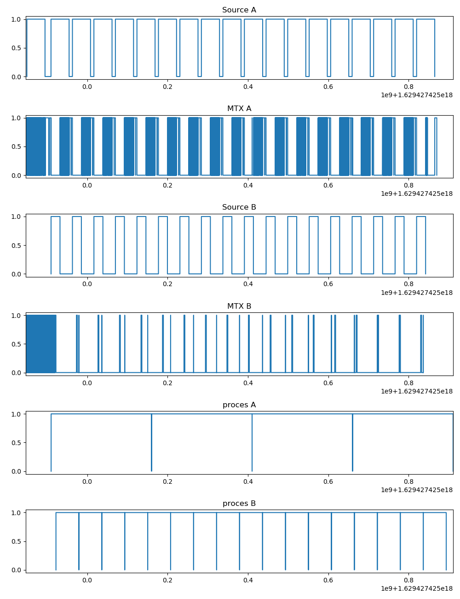

# Pipeline CPP

Implementação de uma estrutura de pipeline, para coleta de dados e processamento em paralelo.


## Execução

```
$ mkdir build && cd build
$ cmake ..
$ make
$ ./pipelines_cpp > dados.txt
```

Gerar profile:

```
$ python3 ../grafico.py
```

## Profile de execução

